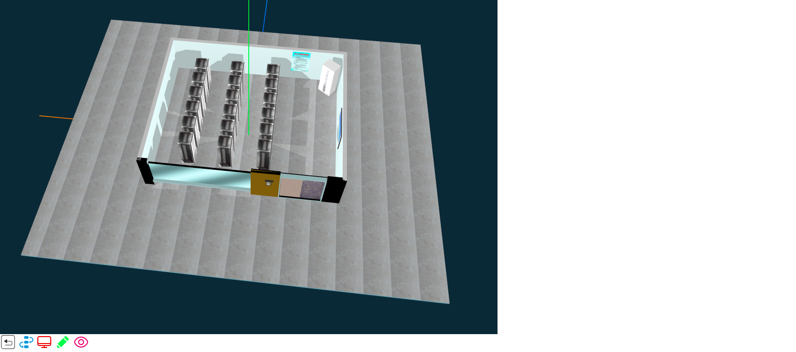

# 一个3D机房完整的例子

***
## 第三库说明
* [jquery官方网站](http://jquery.com/)
* [three.js stats.min.js OrbitControls.js tween.min.js](https://github.com/mrdoob/three.js)
* [ThreeCSG.js](./ThreeCSG.js)  [官方网站](https://github.com/chandlerprall/ThreeCSG)

***
## 封装库
* [msj3D.js](./msj3D.js)
* [data.js](./data.js)

***
## html代码
```html
<!DOCTYPE html>
<html>
<head>
	<meta charset="utf-8">
	<title>3D example</title>
	<style type="text/css">
		body
		{
			margin: 0px;
		}
		#canvas-frame
		{
			width: 1000px;
			height: 800px;
			/*background: red;*/
		}
	</style>
</head>
<body>
<div id="canvas-frame" class="canvas_frame"></div>
</body>
<script src="https://code.jquery.com/jquery-3.3.1.js"></script>
<script src="../three.js-master/build/three.js"></script>
<script src="../three.js-master/examples/js/libs/stats.min.js"></script>
<script src="../three.js-master/examples/js/controls/OrbitControls.js"></script>
<script src="../ThreeCSG.js"></script>
<script src="../three.js-master/examples/js/libs/tween.min.js"></script>
<script src="../msj3D.js"></script>
<script src="../data.js"></script>
<script type="text/javascript">
	threeStart();
</script>
</html>
```

***
### 效果图如下所示

